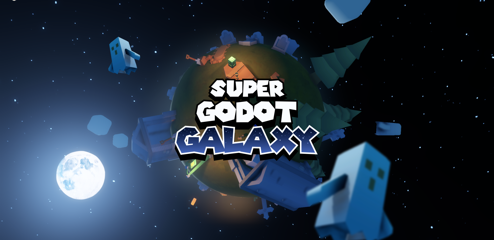
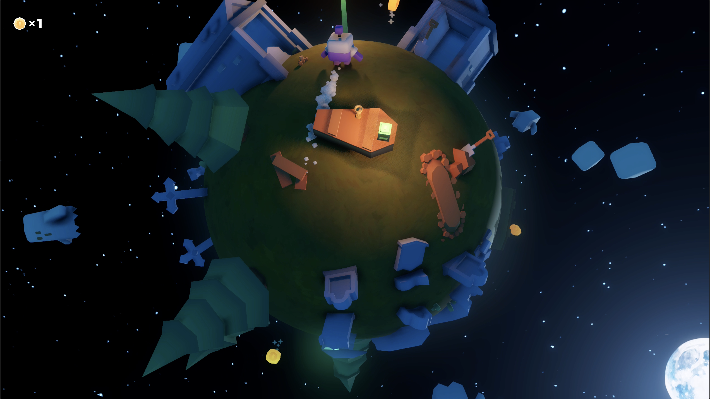

<p align="center"></p>

# Super Godot Galaxy concept

This little project is a concept of Super Mario Galaxy like mechanics made with Godot 4. I dit it to learn about Godot and game dev and used the [3D starter kit](https://godotengine.org/asset-library/asset/2120) from Kenney as starting point.

## Run it locally

Clone the project

```bash
  git clone https://github.com/Hugo-Dz/super-godot-galaxy.git
```

Open Godot and import the `project.godot` file

## Screenshot

<p align="center"></p>

## Blender tutorial (for starry skybox)

You can find a quick toturial on how to create a starry night sky with Blender [here](https://x.com/HugoDuprez/status/1713973279147372546?s=20).

## Tips to publish Godot 4 games on the Web

Godot 4 introduced multithreading using SharedArrayBuffer, so make sure to set the required COOP and COEP Headers on your server.
> To publish on Itch io, you need to enable the SharedArrayBuffer support option.

## Special thanks

Kenney for the awesome assets and 3D starter kit. Check out his work at [kenney.nl](https://kenney.nl/).

## License

MIT License